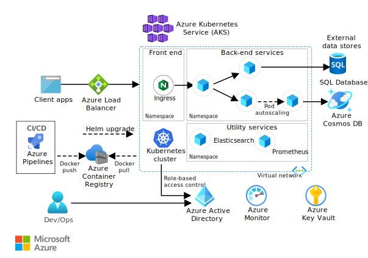

# mjd-aks-terraform-ci-cd
this Toutorial will describe step by steb how to deploy sample application on aks with terraform as IAC tools

# Step Description
## Step 0
We suppose that Step 0 that concern high level design is done
in this sample, we will use standard reference architecture described here https://learn.microsoft.com/en-us/azure/architecture/reference-architectures/containers/aks-microservices/aks-microservices

## Step 1
Infrastructure Deployement

## Step 2
Perparing and packaging our solution (Application View)

## Step 3
Infrastructure presrequisite    : Update terraform Code
Devops presrequisite            : Manually == > in the future, we will use terraform to manage Azure Devops presrequiste

## Step 4
Prepare IAC CI/CD Piplines

## Step 5 
Prepare Application (Solution) CI Piplines

## Step 6 
Prepare Application (Solution) CD Piplines

## Step 7 
test our Application

## useful links

## Welcome comment

## Versioning
version : mjd-00001

